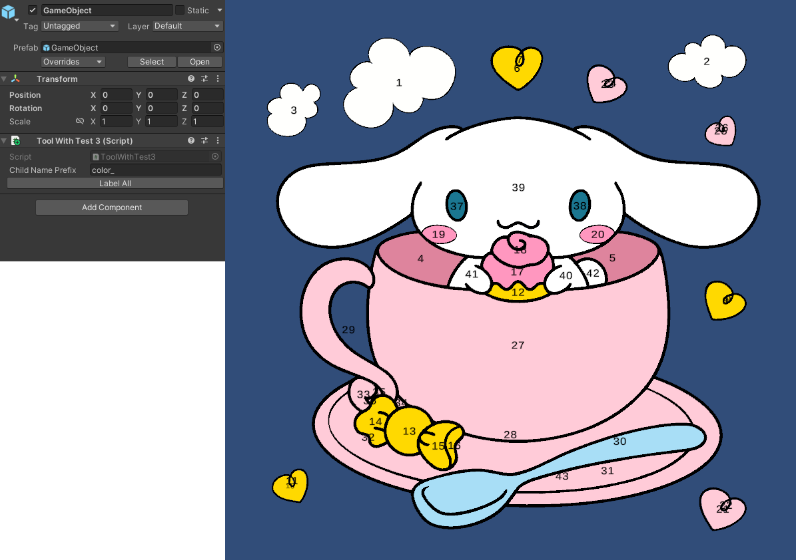

# Test 1: tùy chỉnh các thông số để nhân vật

#
- Speed Player: là tốc độ của player
- Angle Look: là góc tối đa để tìm kiếm các target tính từ hướng forward của player sang hai bên
- Rotate Smooth: là tốc độ quay của Model trong Player
# Test 2:

#
- material và shader của test 2 nằm trong folder Asset/Test2
- ảnh panel demo ở trong canvas của scene_1(test_1)
# Test 3:

#
- phần tìm vị trí để set cho object text chưa tối ưu cho các hình đặc biệt
- phần auto scale của text chưa tìm được hướng giải quyết
